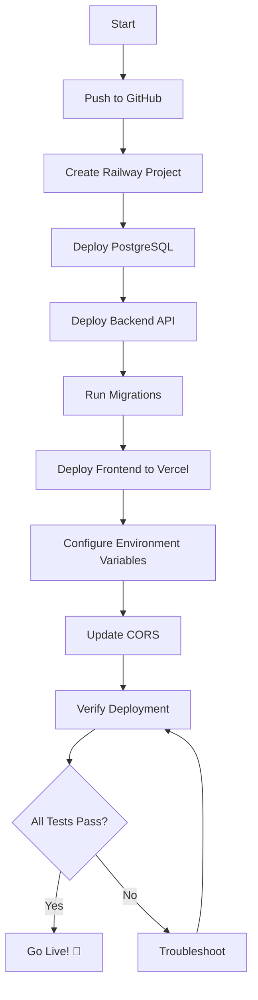

# 📚 Deployment Documentation Index

Welcome to CareerForge AI deployment documentation! Choose your path:

---

## 🚀 Quick Links

| Document | Purpose | Time Required |
|----------|---------|---------------|
| [**QUICK_DEPLOYMENT.md**](./QUICK_DEPLOYMENT.md) | Fast deployment (experienced users) | 30 minutes |
| [**COMPLETE_DEPLOYMENT_GUIDE.md**](./COMPLETE_DEPLOYMENT_GUIDE.md) | Detailed step-by-step guide | 1-2 hours |
| [**DEPLOYMENT_CHECKLIST.md**](./DEPLOYMENT_CHECKLIST.md) | Verification checklist | 30 minutes |

---

## 📖 Documentation Guide

### 1️⃣ First Time Deploying?

Start here: **[COMPLETE_DEPLOYMENT_GUIDE.md](./COMPLETE_DEPLOYMENT_GUIDE.md)**

This guide includes:
- ✅ Complete prerequisites list
- ✅ Step-by-step instructions with screenshots references
- ✅ Detailed explanations of each service
- ✅ Troubleshooting section
- ✅ Security best practices
- ✅ Post-deployment monitoring

**Perfect for:** Beginners, students, or anyone deploying for the first time.

---

### 2️⃣ Need Fast Deployment?

Use: **[QUICK_DEPLOYMENT.md](./QUICK_DEPLOYMENT.md)**

Condensed guide with:
- ⚡ 6 simple steps
- ⚡ 30-minute deployment
- ⚡ Quick troubleshooting
- ⚡ Essential commands only

**Perfect for:** Experienced developers who know Railway/Vercel.

---

### 3️⃣ Want to Verify Deployment?

Follow: **[DEPLOYMENT_CHECKLIST.md](./DEPLOYMENT_CHECKLIST.md)**

Comprehensive checklist covering:
- ✓ Pre-deployment checks
- ✓ Service configuration
- ✓ Integration testing
- ✓ Performance verification
- ✓ Security audit
- ✓ Final sign-off

**Perfect for:** Quality assurance and final verification before going live.

---

## 🛠️ Deployment Scripts

Automate your deployment with these scripts:

### PowerShell (Windows)

```powershell
# Deploy backend to Railway
.\deploy-to-railway.ps1

# Verify deployment
.\verify-deployment.ps1 -FrontendUrl "https://your-app.vercel.app" -BackendUrl "https://your-api.railway.app"
```

### Bash (Linux/Mac)

```bash
# Deploy backend to Railway
./deploy-to-railway.sh

# Make scripts executable
chmod +x *.sh
```

---

## 📋 Deployment Architecture

```
┌─────────────────────────────────────────┐
│                                         │
│  Users → Frontend (Vercel)              │
│          ↓                              │
│          Backend (Railway)              │
│          ↓                              │
│          PostgreSQL (Railway)           │
│          ↓                              │
│          Groq AI API (External)         │
│                                         │
└─────────────────────────────────────────┘
```

**Services Used:**
- **Vercel**: Frontend hosting (React + Vite)
- **Railway**: Backend API + PostgreSQL database
- **Groq**: AI chat API
- **Gmail**: Email notifications (optional)

---

## 🎯 Deployment Workflow

```
1. Prepare Code
   └─> Push to GitHub
       └─> Deploy Database (Railway)
           └─> Deploy Backend (Railway)
               └─> Deploy Frontend (Vercel)
                   └─> Configure Services
                       └─> Verify & Test
                           └─> Go Live! 🎉
```

---

## 📝 Environment Variables

### Backend (.env.production)

See: [`.env.production.example`](./.env.production.example)

Required variables:
- `DATABASE_URL` - PostgreSQL connection
- `JWT_SECRET` - Authentication secret
- `GROQ_API_KEY` - AI API key
- `CORS_ORIGIN` - Frontend URL

### Frontend (Vercel)

See: [`frontend/.env.production.example`](./frontend/.env.production.example)

Required variables:
- `VITE_API_URL` - Backend API URL
- `VITE_APP_NAME` - Application name

---

## 🆘 Getting Help

### Common Issues

| Issue | Solution |
|-------|----------|
| CORS error | Update `CORS_ORIGIN` in Railway |
| Build fails | Check Node version (18+) |
| Database error | Verify `DATABASE_URL` format |
| AI not working | Check `GROQ_API_KEY` validity |

See full troubleshooting in [COMPLETE_DEPLOYMENT_GUIDE.md](./COMPLETE_DEPLOYMENT_GUIDE.md#troubleshooting)

### Support Resources

- 📖 [Railway Docs](https://docs.railway.app)
- 📖 [Vercel Docs](https://vercel.com/docs)
- 📖 [Prisma Docs](https://www.prisma.io/docs)
- 💬 [Railway Discord](https://discord.gg/railway)
- 💬 [Vercel Discord](https://vercel.com/discord)

---

## ✅ Pre-Deployment Checklist

Before you start, ensure you have:

- [ ] GitHub account
- [ ] Railway account (free $5 credit/month)
- [ ] Vercel account (free tier)
- [ ] Groq API key (free from console.groq.com)
- [ ] Node.js 18+ installed locally
- [ ] Code committed to GitHub repository
- [ ] 30-60 minutes of time

---

## 🎓 Deployment Flow Diagram



---

## 🔒 Security Reminders

Before deployment:

- [ ] All secrets in environment variables
- [ ] `.env` files in `.gitignore`
- [ ] Strong JWT secret (32+ characters)
- [ ] Strong database password
- [ ] CORS restricted to your domain
- [ ] Rate limiting enabled
- [ ] HTTPS enforced (automatic on Vercel/Railway)

---

## 📊 Cost Estimation

### Free Tier (Recommended for Development)

| Service | Free Tier | Monthly Cost |
|---------|-----------|--------------|
| Railway | $5 credit | $0 |
| Vercel | Unlimited deployments | $0 |
| Groq AI | 30 req/min | $0 |
| Gmail SMTP | Unlimited | $0 |
| **Total** | | **$0/month** |

### Production (Paid Tier)

| Service | Plan | Monthly Cost |
|---------|------|--------------|
| Railway | Developer | $5-20 |
| Vercel | Pro | $20 |
| Groq AI | Pay-as-you-go | $5-50 |
| **Total** | | **$30-90/month** |

---

## 🚀 After Deployment

Once deployed, you should:

1. ✅ Complete [DEPLOYMENT_CHECKLIST.md](./DEPLOYMENT_CHECKLIST.md)
2. 📊 Set up monitoring (UptimeRobot, Sentry)
3. 📧 Configure email notifications
4. 🎨 Customize branding
5. 📱 Test on mobile devices
6. 🔍 Run security audit
7. 📈 Monitor analytics
8. 🐛 Fix any issues
9. 🚀 Announce launch
10. 🎉 Celebrate!

---

## 📞 Contact & Support

**Need help with deployment?**

1. Check the [Troubleshooting section](./COMPLETE_DEPLOYMENT_GUIDE.md#troubleshooting)
2. Review the [Deployment Checklist](./DEPLOYMENT_CHECKLIST.md)
3. Search existing [GitHub Issues](https://github.com/vamsikiran1234/careerforge-ai/issues)
4. Create a new issue with deployment logs

---

## 📅 Deployment Maintenance

### Weekly
- Check Railway/Vercel logs
- Review error reports
- Monitor resource usage

### Monthly
- Update dependencies
- Review security advisories
- Backup database
- Rotate API keys

### Quarterly
- Performance audit
- Cost review
- Feature planning
- Security audit

---

## 🎉 Success!

Once you've completed the deployment, you'll have:

✅ Production-ready full-stack application  
✅ Scalable cloud infrastructure  
✅ AI-powered features  
✅ Professional deployment  
✅ Comprehensive monitoring  

**Your application is ready to serve users worldwide!**

---

**Last Updated:** November 22, 2025  
**Version:** 1.0.0  
**Maintained By:** CareerForge AI Team
