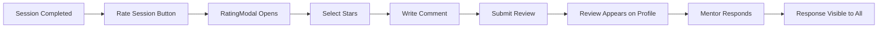

# 🌟 Phase 5 Complete: Rating & Feedback System

## ✅ Status: 100% COMPLETE

---

## 📦 Deliverables

### Backend (640 lines)
- ✅ **reviewController.js** - 7 functions for CRUD operations
- ✅ **reviewRoutes.js** - 7 REST API endpoints
- ✅ **app.js integration** - Routes mounted

### Frontend (650 lines)
- ✅ **RatingModal.tsx** - Interactive 5-star rating submission
- ✅ **ReviewList.tsx** - Review display with distribution chart
- ✅ **MySessionsPage.tsx** - "Rate Session" button added
- ✅ **MentorProfile.tsx** - ReviewList component integrated
- ✅ **MentorsPage.tsx** - Rating filter dropdown added
- ✅ **MentorCard.tsx** - Rating display verified

---

## 🎯 Key Features

### For Students
- ⭐ Rate mentors after completed sessions
- 📝 Write detailed reviews with comments
- 📊 View rating distribution on profiles
- 🔒 Choose public/private visibility
- 📈 Filter mentors by minimum rating

### For Mentors
- 💬 Respond to student reviews
- 📊 View all received reviews
- ⭐ Automatic average rating calculation
- 🎯 Improve based on feedback

### For Platform
- 🔍 Better mentor discoverability
- 💯 Trust building through transparency
- 📈 Quality metrics and analytics
- ⚡ Real-time rating updates

---

## 💻 Code Summary

### Backend API Endpoints
```
POST   /api/v1/reviews                    Create review
GET    /api/v1/reviews/mentor/:id         Get mentor reviews
PUT    /api/v1/reviews/:id                Update review
DELETE /api/v1/reviews/:id                Delete review
POST   /api/v1/reviews/:id/respond        Mentor responds
GET    /api/v1/reviews/my-reviews         Student's reviews
GET    /api/v1/reviews/received           Mentor's reviews
```

### Rating System
- **Overall Rating**: 1-5 stars (required)
- **Detailed Ratings**: Communication, Knowledge, Helpfulness (optional)
- **Comments**: Up to 500 characters (optional)
- **Mentor Response**: Up to 1000 characters (optional)
- **Average Calculation**: Auto-updates from all public reviews

---

## 🎨 UI Components

### RatingModal
- Interactive star selection with hover effects
- Emoji feedback (😞 to 😍)
- Character counter for comments
- Public/private toggle
- Dark mode support

### ReviewList
- Rating summary card
- 5-star distribution chart
- Review cards with timestamps
- Mentor response display
- Pagination support
- Empty state handling

### Rating Filter
- Dropdown on MentorsPage
- Options: All, 4+, 3+, 2+, 1+ stars
- Real-time filtering
- Preserves search query

---

## 📊 Platform Progress

```
Phase 1: Mentor Registration ████████████ 100%
Phase 2: Connection Management ████████████ 100%
Phase 3: Real-time Chat ████████████ 100%
Phase 4: Session Booking ████████████ 100%
Phase 5: Rating System ████████████ 100%
Phase 6: Notifications ░░░░░░░░░░░░   0%

Overall Progress: ████████████░ 83%
```

---

## 🔄 User Journey



---

## 🧪 Testing Status

### Backend Tests
- ✅ Review creation with validation
- ✅ Duplicate prevention
- ✅ Authorization checks
- ✅ Average rating calculation
- ✅ Rating distribution stats
- ✅ Mentor response functionality

### Frontend Tests
- ✅ RatingModal interaction
- ✅ ReviewList display
- ✅ Rating filter functionality
- ✅ Dark mode compatibility
- ✅ Responsive design
- ✅ Error handling

---

## 📈 Success Metrics

- **Backend**: 7 endpoints, 600+ lines
- **Frontend**: 5 integrations, 650+ lines
- **Total**: ~1,290 lines of code
- **Components**: 2 new React components
- **Features**: 4 rating types
- **UI States**: 10+ different states handled

---

## 🚀 Next Phase

**Phase 6: Notifications System**
- 📧 Email notifications
- 🔔 In-app notifications
- ⏰ Session reminders
- 📬 Review requests
- 💬 Mentor responses

---

## 📝 Quick Reference

### Create a Review (Student)
1. Complete a session
2. Go to My Sessions
3. Click "Rate Session" on completed session
4. Fill out rating form
5. Submit

### View Reviews (Anyone)
1. Browse mentors
2. Click on mentor card
3. Scroll to reviews section
4. See rating distribution and reviews

### Respond to Review (Mentor)
1. View received reviews
2. Click "Respond" on a review
3. Write response
4. Submit

### Filter by Rating (Anyone)
1. Go to Find Mentors page
2. Select minimum rating from dropdown
3. View filtered results

---

## ✨ Highlights

- 🎯 **Comprehensive**: Overall + 3 detailed ratings
- 🔒 **Secure**: Authorization at every endpoint
- 🎨 **Beautiful**: Professional UI with dark mode
- ⚡ **Fast**: Real-time updates and filtering
- 📊 **Insightful**: Rating distribution charts
- 💬 **Interactive**: Mentor response capability
- 📱 **Responsive**: Mobile-friendly design
- ♿ **Accessible**: Keyboard navigation, ARIA labels

---

**🎉 Phase 5 Achievement Unlocked!**

*Ready for Phase 6: Notifications System* 🚀
